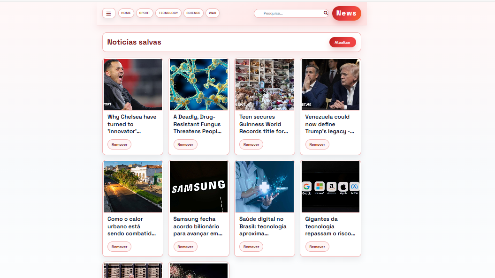
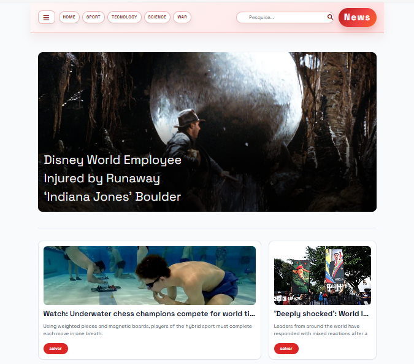

# Objetivo

Projeto feito para entender melhor cookies e sessao em uma aplicacao Node/Express.

## O que o portal faz

Busca noticias da NewsAPI, permite pesquisar por termos e navegar por categorias. Usuarios podem cadastrar, entrar, salvar noticias e remover do perfil.

## Screenshots

## Requisitos

- Node.js 18+
- npm
- Postgres 13+

## Configuracao

Crie um banco Postgres e as tabelas usadas pelo backend:

- `cliente` (id, nome, senha)
- `noticiassalvas` (id, user_id, titulo, descricao, url, img)
- `session` (criada automaticamente pelo connect-pg-simple)

## Instalacao

1) Instale as dependencias (dentro da pasta `projtto`):
2) Configure o Postgres e o `.env` com suas credenciais.
3) Rode o backend e o frontend em terminais separados.
- npm install express-session
- node server\server.js
